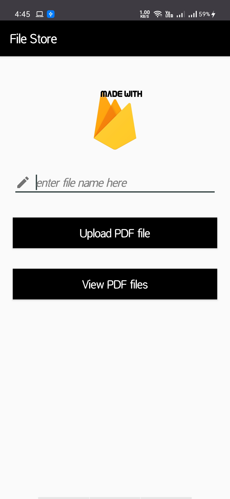

# File Store
- **An android mobile application to store and retreive PDF files using google firebase database.**

 

# Google Firebase

Google Firebase is a Google-backed application development software that enables developers to develop iOS, Android and Web apps. Firebase provides tools for tracking analytics, reporting and fixing app crashes, creating marketing and product experiment.

# Firebase offers a number of services, including:

Analytics – Google Analytics for Firebase offers free, unlimited reporting on as many as 500 separate events. Analytics presents data about user behavior in iOS and Android apps, enabling better decision-making about improving performance and app marketing.
Authentication – Firebase Authentication makes it easy for developers to build secure authentication systems and enhances the sign-in and onboarding experience for users. This feature offers a complete identity solution, supporting email and password accounts, phone auth, as well as Google, Facebook, GitHub, Twitter login and more.
Cloud messaging – Firebase Cloud Messaging (FCM) is a cross-platform messaging tool that lets companies reliably receive and deliver messages on iOS, Android and the web at no cost.
Realtime database – the Firebase Realtime Database is a cloud-hosted NoSQL database that enables data to be stored and synced between users in real time. The data is synced across all clients in real time and is still available when an app goes offline.
Crashlytics – Firebase Crashlytics is a real-time crash reporter that helps developers track, prioritize and fix stability issues that reduce the quality of their apps. With crashlytics, developers spend less time organizing and troubleshooting crashes and more time building features for their apps.
Performance – Firebase Performance Monitoring service gives developers insight into the performance characteristics of their iOS and Android apps to help them determine where and when the performance of their apps can be improved.
Test lab – Firebase Test Lab is a cloud-based app-testing infrastructure. With one operation, developers can test their iOS or Android apps across a variety of devices and device configurations. They can see the results, including videos, screenshots and logs, in the Firebase console.
Use cases                                                                    

# Firebase use cases include:

Create onboarding flows – developers can give users a quick, intuitive sign-in process using Firebase Authentication. They allow users to sign into their apps via their Google, Twitter, Facebook or GitHub accounts in less than five minutes. Developers can also track each step of their onboarding flows to enhance the user experience. Additionally, developers can use Google Analytics for Firebase to log events at each step of their onboarding flows, create funnels to determine where users are dropping off and use remote configuration to make changes to their apps to see how those changes affect conversions.
Customize a “welcome back” screen – developers can use personalization to give every user the best experience by customizing the initial screen based on a user’s preferences, usage history, location or language. Developers can define audiences based, in part, on user behaviors and show targeted content to each audience.
Progressively roll out new features – developers can launch new features with minimal risk by first testing those features on a few users to see how they work and how users respond. Then, when developers are satisfied, they can roll out their apps to the rest of their users.
Security leak                                                                                    

In June 2018, mobile security firm Appthority reported that thousands of iOS and Android mobile apps were exposing more than 113 GBs of data via 2,271 misconfigured Firebase databases.

Beginning in January 2018, Appthority researchers scanned mobile apps that used Firebase systems to store user data and analyzed communications pattern for requests made to Firebase domains.

After scanning over 2.7 million Android and iOS apps, researchers identified 28,502 mobile apps (1,275 iOS and 27,227 Android) that connected and stored data inside Firebase backends.

Of these, 3,046 apps (600 iOS and 2,446 Android) saved data inside 2,271 misconfigured Firebase databases that enabled anyone to view their content.

The databases exposed over 100 million records of user data, including more than 4.5 million LinkedIn, Firebase, Facebook and corporate data store user tokens; 25 million GPS location records; over 4 million protected health information records, such as prescription details and chat messages; 2.6 million user IDs and plaintext passwords; and 50 thousand financial records, including payment, banking and Bitcoin transactions.

# Pricing

Firebase offers a free plan with 1 GB of real-time database storage and two paid subscription plans: Flame Plan ($25 per month for 2.5 GB of storage) and Blaze Plan (pay-as-you-go, $5 per GB of storage). All the plans include A/B testing, analytics, app indexing, authentication (except phone auth), cloud messaging, crashlytics, dynamic links, invites, performance monitoring, predictions and remote config.

The main differences between the plans include the allocated storage on the real-time database, number of upload operations, Cloud Firestone bandwidth, and more.

 

